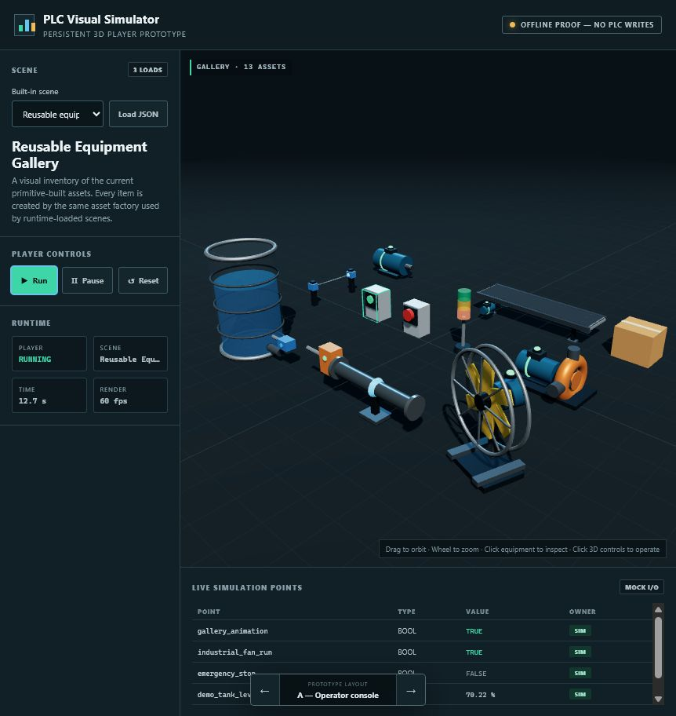

# RungProof — PLC Visual Simulator

**Build the logic. Prove the machine.**

RungProof is a PLC-led native plant simulator for testing ladder logic against
deterministic machine behavior and a real Siemens S7-1500. TIA creates the
ladder, the PLC executes it, and RungProof simulates the machine feedback and
visual response. It does not need an offline controller for the current pilot.

The current declared version is read from [`VERSION`](VERSION). It is being
prepared for a controlled instructor/controls-lab pilot, not a general public
or production-machine release. The exact supported configuration and exclusions
are authoritative in:

- [Supported configuration](docs/SUPPORTED_CONFIGURATION.md)
- [Known limitations](docs/KNOWN_LIMITATIONS.md)
- [Release checklist](docs/RELEASE_CHECKLIST.md)
- [Launch-readiness plan](docs/LAUNCH_READINESS_PLAN.md)

- the shipped VM default is an orbitable isometric 3D scene rendered through a
  software-backed Qt Widget, not a browser shell, flat schematic, or
  VM-sensitive native OpenGL child window;
- Qt 3D remains an explicit `--renderer qt3d` workstation option;
- one native worker directly owns the Snap7 session;
- Run, Stop, and Reset are the only playback controls. Reset does not
  disconnect the PLC;
- rendering consumes immutable snapshots and is not in the PLC cycle path;
- `.plcscene` physics remain separate from the external DB14 profile.

The existing `Siemens-PLC-PC-Interface` working tree remains unchanged. The
diagnostic and guarded live runtime use a pinned, documented source snapshot at
commit `754fcfb88192f2a932bd7df70feea0d08088ab97`.

The current native vertical slice is Scene 2 - Conveyor Pusher. The earlier
browser prototype and its 32 scene contracts remain in source as migration and
regression references; they are not launched or packaged as the application.

Product and review records:

- [Native asset approval register](docs/NATIVE_ASSET_APPROVAL_REGISTER.md)
- [Project chat compilation](docs/PROJECT_CHAT_COMPILATION.md)
- [Product review and roadmap](docs/PRODUCT_REVIEW_AND_ROADMAP.md)
- [Serious code and architecture review](docs/SERIOUS_CODE_REVIEW.md)
- [RungProof brand system](docs/brand/RUNGPROOF_BRAND_SYSTEM.md)



## Run it

Double-click:

```text
RUN-3D-PLAYER.cmd
```

Or run:

```powershell
build\.venv-rungproof\Scripts\python.exe -m tools.rungproof_native
```

The launcher opens one native RungProof window. It does not start Edge, Chrome,
Electron, WebView, an HTML engine, or a local HTTP server. Python 3.14 and
Node.js 24 are required only for source development and the full regression
lane.

Use **View** or `Alt+1`, `Alt+2`, and `Alt+3` to switch among the three native
workspaces without reconnecting or changing playback:

- **A - Operator console:** control rail, central machine cell, health/equipment
  rail, and a full-width live-point strip;
- **B - Immersive floor:** viewport-first layout with compact edge cards;
- **C - Engineering split:** controls and live points on the left, machine cell in
  the center, and runtime/health/equipment diagnostics on the right.

All three views reuse one viewport, one `NativePlcSession`, and the same
immutable snapshot stream. The single product header and bottom transport HUD
remain present in every view. A view can also be selected at startup:

```powershell
build\.venv-rungproof\Scripts\python.exe -m tools.rungproof_native --view B
```

## Standalone Windows VM package

The VM does not need Python or npm. Copy this ZIP to the VM and extract it:

```text
build\RungProof-VM.zip
```

Then double-click:

```text
RungProof.exe
```

The EXE has no console window. It opens one native Qt application window.
Closing the window closes the direct S7 session and stops the application.

Validated PLC interface profiles are stored separately in:

```text
plc-profiles\
```

The native Scene 2 application loads and locks
`scene-2-db14-pusher-interface.json`. **Connect Real PLC** displays the exact
write scope and requires explicit authorization. **Test PLC - Read-only**
is located directly under the PLC menu rather than duplicated on the main
screen. It opens a separate short connection, reads the configured tags twice,
writes zero PLC values, and disconnects. The live Connect path is structurally
blocked while that diagnostic is active. The packaged EXE includes Qt and
Snap7; the VM does not need Python, npm, a browser, or a separate Snap7
installation. Scene playback never connects automatically.

To rebuild the package:

```powershell
py -3 -m pip install -r requirements-build.txt
powershell -NoProfile -ExecutionPolicy Bypass -File tools\run_checks.ps1 release -EnableRealPlc
```

To create the internal live-PLC test candidate after the source checks pass:

```powershell
powershell -NoProfile -ExecutionPolicy Bypass -File tools\build_vm_exe.ps1 -EnableRealPlc
```

That switch enables the guarded connection capability; it is not evidence that
the PLC/TIA configuration passed the live bench procedure.

The builder creates both
`build\RungProof-VM\RungProof.exe` and
`build\RungProof-VM.zip`. It also creates a versioned delivery archive such
as `build\RungProof-VM-v0.2.0-pilot.2.zip` and matching folder. The root
`VERSION` file is the single release-version authority. A command-line
`-PackageVersion` is accepted only when it exactly matches `VERSION`.
The executable is unsigned, so Windows
SmartScreen may ask the user to confirm the first launch.

## Supported native pilot workflow

1. Extract the complete versioned ZIP to a normal writable folder.
2. Confirm the packaged `VERSION`, `README-VM.txt`, `SHA256.txt`, `licenses`,
   and `plc-profiles` remain beside `RungProof.exe`.
3. Launch RungProof. It starts disconnected and makes no PLC connection.
4. Review Scene 2 and confirm the displayed target/profile matches the bench.
5. Use **Test PLC - Read-only** only on the approved isolated bench. It reads
   the configured points twice and contains no write operation.
6. In the internal PLC-enabled candidate, use **Connect Real PLC** to perform
   the exact TIA/CPU/DB14 bench gate after the displayed write scope is checked.
7. Use Disconnect or Close to end the persistent session. Readiness or
   transport recovery always requires a fresh operator Run.

S03-S06 are review-only. Their Run, Reset, Test PLC, and Connect actions
must remain unavailable. The Scene Editor and browser player are development
proofs and are not supported or packaged in the pilot.

## Archived browser-prototype walkthrough

The steps below document the earlier browser prototype and its migration
reference behavior. They do not describe the current packaged native Scene 2
vertical slice and are not pilot operating instructions. For current VM setup,
use `packaging\vm\README-VM.txt` and the supported workflow above.

Every scene now loads with the controller **DISCONNECTED**. Inputs can change,
but PLC-owned outputs remain safe and **Run** is rejected. For offline
demonstration, explicitly click **Offline Fake PLC: OFF**. For real hardware,
use **Connect Real PLC**, verify the exact address scope, and confirm it.
Changing scenes disconnects either controller mode.

1. Open **View** and switch among A — Operator console, B — Immersive floor,
   and C — Engineering split. All three are supported views of the same player.
2. Use the scene library to select a scene, then use the bottom transport HUD
   to Run, Stop, or Reset it. **Stop** is an operator stop that holds the current
   process state; **Reset** returns the scene to its defined initial state.
   When a real PLC is connected, both controls leave that session and its
   watchdog heartbeat connected. Use **Disconnect Real PLC** to deliberately
   close the live session.
   The HUD distinguishes `OPERATOR STOP`, `SYSTEM STOP`, `START BLOCKED`, and
   `INTERLOCK STOP`.
3. For any scene, click **Configuration** to see only the exact external tag
   contract: name, data type, direction, initial value, and purpose. The table
   is generated from the scene's required `simulation.points` declaration and
   does not contain the control answer. Simulator-only diagnostics remain
   visible in the live-points table but are explicitly excluded from the PLC
   interface.
4. Click **Hint** to reveal help progressively. Click **Solution**, then
   explicitly confirm **Reveal reference solution**, only when the functional
   answer is wanted.
5. Open **Scene 1 — Conveyor stop**, click **Run**, and watch the package stop
   at 0.50 m when `simulated_photoeye` becomes true. The scene enters
   `SYSTEM STOP`, turns the conveyor output off, and rejects another Start while
   the package still blocks the photoeye.
6. Open **Scene 2 — Conveyor pusher**, click **Run**, and watch the complete
   run/stop/push/transfer/retract/reload sequence.
7. Click **Save**. The player writes a normalized `.plcscene` file into
   `prototype/saved-scenes` and adds it to the scene library selector.
8. Select another scene, then select the new **Saved — ...** entry to reload it
   without restarting.
9. Click **Load** to open a portable `.plcscene` file from another folder.
   Legacy `.json` scene files are still accepted during the prototype.
10. Open **Conveyor inspection cell**, click **Run**, and watch
   `photoeye_blocked` change as cartons cross the sensor.
11. Change the scene selector to **Tank level / 4–20 mA**. The application
   window and renderer stay open; only the scene is replaced.
12. Click **Run**, then **Start inlet pump** or **Open drain valve**.
13. Watch the visible fluid, level switches, percentage, and 4–20 mA point move
    together.
14. Select **Loop scene** to automatically Reset and Start again after a normal
    program-complete or system stop. Loop still checks every Start permissive.
    It never automatically restarts an operator Stop, interlock, or latched
    fault.
15. Click **Faults & alarms** or press **F8**. The popup is scoped to the
    currently loaded scene and shows active, unacknowledged, and historical
    simulated alarms. Acknowledgement changes only this local player.
15. Select **Water tank — high/low switches** to test a discrete-only tank.
16. Select **Water tank — radar level** to see a top-mounted radar beam, measured
   distance, percentage, echo status, and idealized 4–20 mA feedback.
17. Select **Reusable equipment gallery** to inspect the current asset library.
18. Click the green or amber controls inside the 3D scene to operate the
   conveyor, pump, or drain. The equipment model is now an interactive control
   surface, not just a picture.
19. In the gallery, use the green 3D pushbutton to start the motor, conveyor,
   pump, and industrial fan. The red emergency stop latches them off until it is
   clicked again to reset.
20. Click other 3D equipment to show its asset type, ID, position,
   configuration, and applicable live state.
21. For a non-writing setup check, open **PLC > Read-only PLC check**. The
    dialog automatically loads the exact
    profile assigned to the active scene, shows its IP/rack/slot/tag count, and
    requires a second explicit click before it opens a read-only S7 session.
    A scene with no assigned profile has no Run button and makes no connection.
22. To bind a real PLC, select Scene 1 or Scene 2 and click **Connect Real
    PLC**. Review both scene-point mappings and every absolute DB read/write,
    check the confirmation box, then connect. Press **Run** only after the
    connection badge reports the real PLC session.
23. Open **Lab 2.05 — Bay light selector**, leave Fake PLC off, and advance the
    selector. The PC input changes to 1 while both PLC lamp commands stay false.
24. Enable Fake PLC. Both reference outputs turn true. Use the **TOGGLE** control
    beside one PLC output to force a deliberately wrong combination and verify
    that only the commanded lamp illuminates.

Mouse controls:

- left-drag: orbit;
- mouse wheel: zoom;
- right-drag: pan;
- click equipment: inspect it;
- click a 3D pushbutton/control face: operate it;
- Space: run/stop;
- Alt+1 / Alt+2 / Alt+3: select View A/B/C;
- Ctrl+O / Ctrl+S: open/save scene.

## Current reusable assets

| Asset | Current proof |
|---|---|
| Motor | Housing, end bells, correctly pivoted shaft, running lamp and green running band |
| Conveyor | Belt, correctly pivoted rollers, frame, legs, drive motor, animated products |
| Box | Configurable carton dimensions and color |
| Photoeye | Emitter/receiver housings and visible clear/blocked beam |
| Switch | Pushbutton and emergency-stop styles |
| Indicator | Configurable multi-color stack light |
| Pump | Stationary centrifugal casing, animated shaft/coupling, running lamp and green running band |
| Industrial fan | Floor stand, guard, six animated blades, rear motor, running lamp |
| Pusher | Single-solenoid visual model, moving rod/plate, and visible extended/retracted limit lamps |
| Tank | Transparent shell and animated visible fluid |
| Level sensor | Low/high discrete switch and analog transmitter styles |
| Radar level sensor | Top-mounted transmitter, mounting rails, echo lamp, visible measurement cone, and surface target |
| Pipe | Configurable axis plus flanges, flow arrow, and optional floor support |
| Rotary switch | Configurable 2- to N-position selector with animated knob |
| Lift table | Animated scissor mechanism, platform, and normalized travel |
| Valve | Animated stem/handwheel with flow indication |
| Drill press | Reusable machine frame, moving head, spindle, and bit |
| Robot arm | Articulated base, shoulder, elbow, gripper, and normalized pose |
| Roller shutter | Slatted curtain, guides, header, and animated drive |
| Rotary table | Indexed round table with visible position witness |
| Enclosed machine | Configurable process cabinet with window, access door, and run lamp |

These are primitive-built proof assets, not final CAD-quality models. The asset
factory is the important part: every scene references an equipment `type` and
configuration instead of containing custom drawing code.

## Built-in scenes

- `prototype/scenes/scene-1-conveyor-stop.plcscene`
- `prototype/scenes/scene-2-conveyor-pusher.plcscene`
- `prototype/scenes/conveyor-cell.json`
- `prototype/scenes/tank-level.json`
- `prototype/scenes/tank-high-low.json`
- `prototype/scenes/tank-radar.json`
- `prototype/scenes/equipment-gallery.json`
- `prototype/scenes/lab-2-01-*.plcscene` through
  `prototype/scenes/lab-2-25-*.plcscene` (25 original training adaptations)

The scene schema is documented in
[docs/SCENE_FORMAT.md](docs/SCENE_FORMAT.md). The portable file contract and
save behavior are documented in
[docs/PLCSCENE_FILE_FORMAT.md](docs/PLCSCENE_FILE_FORMAT.md).
The exercise-to-scene abstraction, symbolic I/O, and per-scene acceptance
criteria are documented in
[docs/TRAINING_SCENE_CATALOG.md](docs/TRAINING_SCENE_CATALOG.md).

Regenerate and verify the training library with:

```powershell
$node = "C:\Users\matt.winter\.cache\codex-runtimes\codex-primary-runtime\dependencies\node\bin\node.exe"
& $node tools\build_training_scenes.mjs
& $node tools\verify_training_scenes.mjs
```

## Future scene builder

The current asset factory and scene JSON are deliberately the foundation for a
user-facing scene builder. A future editor can present these equipment types as
a palette, let users place and rotate instances, edit only validated
properties, bind symbolic simulation points, and save the same JSON documents
that this player already loads.

The editor should not put PLC addresses or unrestricted scripts in scene files.
Undo/redo, copy/paste, snapping, schema migration, and separate guarded point
bindings are required before this becomes a production authoring tool.

### Separate editor proof

A functional, isolated authoring proof now lives in
`scene-editor-prototype`. Start it with:

```powershell
.\RUN-SCENE-EDITOR.cmd
```

It reuses the real 3D asset factory, lets the user add and transform catalog
parts, and compiles a typed conveyor/photoeye/pusher composition into a
player-compatible `.plcscene`. It can save directly to the player's local saved
library. This is not yet bundled into the EXE.

The current design deliberately separates:

- PLC-owned symbolic commands;
- typed plant roles and interactions;
- PC-owned simulated feedback.

The PLC should remain the controller. The simulator should model how equipment
and material respond, then return sensor/actuator feedback. The current offline
`conveyorPusher` runtime still combines those concerns and must be split behind
a renderer-neutral runtime before live PLC integration.

See
[scene-editor-prototype/README.md](scene-editor-prototype/README.md)
for the proof boundary and current limits.

## Application views

The player intentionally keeps three structurally different workspace views:

- `?variant=A` — operator console;
- `?variant=B` — immersive floor;
- `?variant=C` — engineering split.

They are selected from the application **View** menu. Changing views preserves
the selected scene, while restarting that scene in the new workspace. The
query parameter remains supported so a specific view can be launched directly.

## Safety boundary

Scene playback starts disconnected and does not connect automatically. The
`PLC` and `PC` labels in the live-point table are enforced by the training and
live runtimes: simulator actions change only PC-owned feedback; configured
PLC-owned points drive the plant. Fake PLC remains an explicit offline mode.

**Connect Real PLC** is a separate guarded path. Before connection, the dialog
shows the exact configured scene-point mappings and absolute DB read/write
scope and requires explicit confirmation. The browser sends only PC-owned
scene points; the server accepts only the configured scope; PLC-owned scene
points are applied only through each simulation's public controller interface.
The exchange is browser-cycle-driven so a stalled/closed browser stops the PC
heartbeat. Stop holds the visual scene and Reset resets the visual model while
the live session and heartbeat remain active. Explicit Disconnect, scene
change, application exit, cycle error, heartbeat fault, or browser-cycle
timeout closes the session. The PLC watchdog remains the authority that makes
controller outputs safe. The player Run controls remain disabled during the
brief live-session STARTING state and enable only after readiness is reported.

The separate **Read-only PLC Check** reuses the validated configuration model and
Snap7 transport from `Siemens-PLC-PC-Interface`. Only after the operator presses
**Run read-only PLC test** does it:

1. open an S7 connection using the exact external profile referenced by the
   active scene;
2. read every configured DB tag twice;
3. report address/type, status-bit, and available heartbeat evidence;
4. disconnect.

That diagnostic contains no transport write call. It does not toggle PLC
commands, change CPU state, bind scene playback to live points, or prove TIA
symbolic names and ladder semantics.

The local Python server can write only normalized `.plcscene` documents to
`prototype/saved-scenes`. This is scene-file persistence, not PLC-memory
access. A scene may persist one safe local `plcTestProfile` filename, but PLC
connection parameters remain outside `.plcscene` files in `plc-profiles`.

Production migration must preserve the existing rules:

- explicit operator authorization before any PLC connection or write;
- strict PC-owned versus PLC-owned point separation;
- no scene-defined physical `%I` or `%Q` addresses;
- fail-safe command suppression when communication is starting, bad, or lost;
- the PLC watchdog remains authoritative;
- the supported exchange period remains the live-proven 20 ms baseline until
  new timing evidence proves otherwise.

Automated tests use an in-memory fake S7 transport and never connect to the
configured CPU. Real PLC commissioning still requires direct observation in
TIA Portal and RungProof on the authorized VM.

See [PROJECT_INFORMATION.md](PROJECT_INFORMATION.md) for the proof record and
migration gates.
